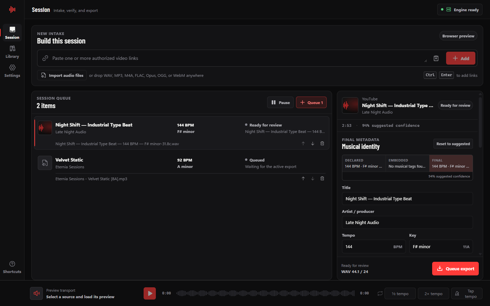

# Sonic

Sonic is a local-first intake, metadata, export, and library workstation for
beat producers. Bring in authorized YouTube videos or local audio, verify the
declared musical information, choose a producer-ready export recipe, and keep
the result in a searchable local library.

[](https://github.com/eterniastudio/sonic/actions/workflows/ci.yml)
[](https://github.com/eterniastudio/sonic/actions/workflows/release.yml)
[](https://github.com/eterniastudio/sonic/releases/latest)



Sonic is published from Eternia Studios' individual GitHub account,
[`@eterniastudio`](https://github.com/eterniastudio).

> [!IMPORTANT]
> Sonic is for media you own or are authorized to download and process. It
> does not bypass DRM, authentication, private-video access, geographic
> restrictions, or platform safeguards. Sonic is not affiliated with or
> endorsed by YouTube.

## What changed in v0.2

Version 0.2 turns the original single-download flow into a producer
workstation:

- multi-source sessions with independent metadata and export settings;
- drag-and-drop and file-picker intake for local audio;
- a persistent, pauseable, reorderable export queue with up to three workers;
- eight fixed and honestly labelled export recipes;
- declared, embedded, suggested, and user-selected metadata shown separately;
- embedded metadata writing plus a versioned `.sonic.json` sidecar;
- filename templates with safe previews and producer-oriented tokens;
- a SQLite-backed local Beat Library with search, filters, re-export, reveal,
  missing-file detection, and explicit deletion controls;
- bounded local audio previews, waveform seeking, looping, tap tempo, and
  half-time/double-time correction;
- startup recovery for interrupted work and no-clobber paired publication;
- engine, database, recovery, and redacted-support diagnostics;
- a modular React/Rust architecture with frontend contract, reducer,
  accessibility, and coverage tests.

Sonic still does **not** claim to detect BPM, key, or tuning directly from the
audio signal. It parses declared text and embedded tags, then lets the producer
verify or correct the final values. Audio-derived analysis remains future work.

## Why Sonic exists

Producer intake should not depend on ad-filled converter sites or opaque
hosted services. Sonic keeps the queue, metadata decisions, conversion,
naming, history, and diagnostics on the local Windows machine.

There are no Sonic accounts, subscriptions, analytics, remote conversion
servers, browser extensions, cookie imports, or self-updating media binaries.
Network access happens only when Sonic inspects or acquires a URL, when the
user explicitly sets up the pinned media engine, or when Windows/GitHub checks
for release information outside the app.

## Core workflow

1. Add one or more authorized YouTube URLs, import local audio, or drop files
   into the Session.
2. Sonic inspects every source before export. Local files are hashed and
   probed; remote sources are validated and inspected through the isolated
   acquisition provider.
3. Compare declared metadata, embedded metadata, Sonic's suggestion, and the
   editable final values.
4. Choose a preset, channel policy, optional LUFS normalization, tag policy,
   filename template, and destination.
5. Queue one item or the complete reviewed batch. Pause dispatch, reorder
   pending work, cancel active work, or retry an interrupted export.
6. Sonic processes each job in a private staging directory, validates the
   output, writes its sidecar, and publishes the audio/sidecar pair without
   overwriting existing files.
7. Search, preview, reveal, re-export, or remove the completed item from the
   Beat Library.

## Features

### Producer metadata

- BPM formats such as `BPM: 144`, `144 BPM`, and `72 / 144 BPM`;
- common major, minor, modal, sharp/flat, compact, and Camelot key formats;
- detune in cents, semitones, half-steps, and directional language;
- `A=432Hz`-style tuning converted to a cents offset from A440;
- source evidence, confidence, alternate tempos, and conflict warnings;
- separate Declared, Embedded, Suggested, and Final values;
- one-click suggested reset, alternate BPM selection, and half/double tempo;
- editable title, artist/producer, BPM, key, detune, and export tags.

### Local audio intake

The desktop picker and drop surface accept WAV, MP3, M4A, FLAC, Opus, OGG,
and WebM audio. Rust validates that the path is absolute, the entry is a
regular non-reparse file, the extension is allowed, the size is within the
configured limit, and ffprobe reports an audio stream.

Sonic reads available container tags, analyzes the filename and tags for
producer metadata, computes a SHA-256 source fingerprint, and rechecks that
fingerprint before using the file in an export.

### Session queue

- independent settings for every source;
- batch review and queueing without playlist ingestion;
- persistent job state and ordering in SQLite;
- concurrency limit of one, two, or three exports;
- pause/resume dispatch while allowing active work to finish safely;
- queued-item editing with revision guards;
- progress, speed, ETA, stage, and actionable error state;
- cancellation, retry, reordering, and completed-item cleanup;
- startup recovery of interrupted or fully published jobs.

### Export recipes

Sonic exposes fixed recipes instead of arbitrary FFmpeg arguments.

| Preset | Output behavior |
| --- | --- |
| Original stream | Preserves the acquired/local stream when possible; no processing or new embedded tags. |
| MP3 V0 | High-quality variable-bitrate MP3. |
| MP3 320 kbps | Constant 320 kbps MP3. |
| M4A AAC 256 kbps | AAC at 256 kbps in an M4A container. |
| WAV 44.1 kHz / 24-bit | Stereo/preserved-channel PCM for common music sessions. |
| WAV 48 kHz / 24-bit | PCM for 48 kHz production and video sessions. |
| FLAC | Lossless compressed audio. |
| Opus 192 kbps | Efficient 192 kbps Opus audio. |

For processed presets, producers can preserve channels, force stereo, or
force mono; enable supported embedded tags; and optionally normalize between
-24 and -8 LUFS. Conversion cannot restore fidelity that is absent from the
source.

### Naming and sidecars

Filename templates support:

```text
{title} {producer} {bpm} {key} {camelot} {detune} {source} {date} {preset}
```

Examples:

```text
{producer} - {title} [{bpm} BPM] [{key}]
{title}_{camelot}_{detune}_{preset}
```

The Rust backend is authoritative for rendering and sanitizing names. It
rejects unknown or unclosed tokens, control characters, unsafe Windows device
names, and paths masquerading as filenames. A collision receives a numbered
suffix; an existing file is never silently replaced.

Every export receives a versioned `.sonic.json` sidecar containing the source
kind and fingerprint, final metadata, evidence and warnings, output audio
properties, export recipe, tag readback status, output SHA-256, and Sonic
schema/version identifiers. Full local source paths are excluded by default
and can be enabled explicitly in Settings.

See [`docs/sidecar-schema.md`](docs/sidecar-schema.md) for the v1 field
reference, privacy behavior, and integrity rules.

### Beat Library

Completed exports can be recorded in a local SQLite library. Search covers
title, artist/producer, filename, BPM, key, and Camelot; filters cover format,
tempo range, key, and missing files.

Library actions include:

- load a bounded local preview and seek its waveform;
- show the output in Explorer;
- open the original source where it is still available;
- create a new export from the recorded audio;
- remove only the local history record; or
- explicitly delete the verified audio and matching sidecar.

Deletion is deliberately conservative. Sonic revalidates the recorded files,
sidecar identity, and audio hash before deleting anything. A changed or
replaced file is left untouched.

### Preview transport

Local Session sources and Library items can be rendered into a short MP3 in
Sonic's application cache. The persistent transport supports play/pause,
waveform seek, loop, tap tempo, and half-time/double-time correction.

Preview files use UUID names, live only in Sonic's scoped preview cache, are
strictly bounded by duration/count/total size, and are removed on release or
cache eviction. A remote YouTube source cannot be previewed before it becomes
a validated local export; the interface labels that boundary instead of
simulating playback.

## Download

Download the latest Windows x64 installer from
[Eternia Studios releases](https://github.com/eterniastudio/sonic/releases/latest).

> [!WARNING]
> The current installer is not Authenticode-signed, so Windows SmartScreen may
> warn before installation. Verify `SHA256SUMS.txt` and the GitHub artifact
> attestation before running it.

Each release includes:

- `Sonic_<version>_x64-setup.exe`, the NSIS installer;
- `SHA256SUMS.txt` for every release attachment;
- npm and Cargo CycloneDX SBOMs;
- generated npm and Rust dependency-license reports;
- the pinned tool manifest and FFmpeg build configuration;
- Sonic's license, third-party notices, and applicable license texts; and
- GitHub build-provenance attestation.

The installer contains pinned yt-dlp and CPython components. Node.js, Rust,
Python, yt-dlp, Deno, and FFmpeg do not need to be installed globally.

### First-run media engine setup

FFmpeg, ffprobe, and Deno are not redistributed inside the installer. When
they are missing, Sonic offers an explicit **Set up engine** action. The setup
downloads immutable pinned artifacts directly from the upstream release
hosts, verifies archive and executable hashes, records provenance, and
re-verifies the executables before every launch.

- Approximate download: 180 MiB.
- Local path: `%LOCALAPPDATA%\studio.eternia.sonic\media-engine`.
- FFmpeg distribution: retained BtbN LGPL build.
- Cleanup: the uninstaller uses a reparse-aware media-engine cleanup hook.

See [`scripts/tool-manifest.json`](scripts/tool-manifest.json) and
[`THIRD_PARTY_NOTICES.md`](THIRD_PARTY_NOTICES.md) for exact versions, URLs,
hashes, sources, and licenses.

### Pinned media components

| Component | Version | Delivery | License |
| --- | --- | --- | --- |
| yt-dlp zipimport package | 2026.07.04 | Bundled | Unlicense with ISC/MIT components |
| CPython embedded runtime | 3.13.14 | Bundled | PSF-2.0 and bundled notices |
| Deno | 2.9.2 | Explicit upstream download | MIT |
| FFmpeg and ffprobe | `N-125365-g9a01c1cb6a-20260630` | Explicit upstream download | LGPL-3.0-or-later |

The manifest pins Sonic's selected media artifacts. It does not claim that
GitHub's Windows runner or the complete NSIS output is bit-for-bit
reproducible.

Sonic targets Windows 10/11 x64 and Microsoft WebView2.

## Verify a release

From PowerShell in the folder containing the installer and checksum file:

```powershell
$expected = (Select-String -Path .\SHA256SUMS.txt -Pattern 'Sonic_.*-setup\.exe').Line.Split()[0]
$installer = Get-ChildItem .\Sonic_*-setup.exe | Select-Object -First 1
$actual = (Get-FileHash -Algorithm SHA256 -LiteralPath $installer.FullName).Hash.ToLowerInvariant()
if ($actual -ne $expected.ToLowerInvariant()) { throw "Installer checksum mismatch" }
```

The release page also exposes GitHub's artifact attestation for provenance
verification.

## Privacy and security model

- The React renderer has no arbitrary process or filesystem execution API.
- Rust owns URL validation, local-path validation, SQLite writes, filename
  rendering, process arguments, cancellation, staging, publication, preview
  scoping, deletion, and diagnostics.
- YouTube intake accepts canonical HTTPS video URLs only; playlists, live
  sources, private authentication, plugins, user configuration, remote
  components, and yt-dlp self-updates are disabled.
- Every executable is resolved by absolute path and checked against the pinned
  manifest. Media subprocesses receive a minimal environment rather than the
  user's general `PATH`.
- User text never becomes a shell command or arbitrary FFmpeg option.
- Configurable duration, source-size, free-space, concurrency, preview, and
  queue limits bound work.
- Jobs use a same-volume `.sonic-job-<UUID>` staging directory, then publish a
  verified audio/sidecar pair with no-replace file operations.
- Queue revisions prevent stale reorder, pause, and queued-edit writes.
- The local SQLite database uses a schema version, application ID, and WAL.
- Diagnostic exports contain versions, health, and aggregate state, with
  source URLs and personal paths redacted.
- Sonic includes no product analytics or hosted Sonic conversion backend.

Sonic is local-first, not offline: URL inspection/acquisition and explicit
engine setup contact their respective providers.

## Architecture

```text
React 19 + TypeScript
  app state/reconciliation
  Session / Inspector / Library / Settings / Transport
  native bridge + browser preview fixture
             |
             | typed Tauri commands and events
             v
Rust + Tauri 2
  commands      typed IPC and compatibility aliases
  acquisition   YouTube/local inspection and ffprobe
  jobs          persistent scheduler, workers, cancellation, recovery
  presets       fixed FFmpeg recipes and tag arguments
  filesystem    paths, templates, staging, no-clobber publication
  storage       SQLite settings, jobs/events, and Beat Library
  preview       bounded preview cache and waveform extraction
  sidecar       versioned privacy-aware producer metadata
  tools         pinned executable resolution and environment isolation
             |
             +-- CPython -> yt-dlp zipimport
             +-- verified Deno challenge runtime
             +-- verified FFmpeg / ffprobe
```

The acquisition provider is intentionally behind a native boundary so the
local-file, metadata, export, and library features remain useful independently
of one remote provider.

## Local data

Sonic stores its database, preview cache, and optional media engine under the
Tauri application-data/cache locations for `studio.eternia.sonic`.

The SQLite database contains settings, persistent queue requests and events,
and optional Library records. It does not contain account credentials or
browser cookies. Removing a Library history record does not delete audio;
deleting audio is a separate, confirmed action.

Database schema migrations are forward-only. Pre-1.0 releases support the
latest schema on a best-effort basis, so back up irreplaceable audio and
sidecars independently of Sonic's database.

## Development

Requirements:

- Windows 10/11 x64;
- Node.js 22 and npm;
- Rust 1.94.0 with the MSVC target, rustfmt, and Clippy;
- Tauri's Windows build prerequisites and WebView2; and
- PowerShell 5.1 or later.

Install the JavaScript dependencies:

```powershell
npm ci
```

Fetch and verify the pinned development media tools:

```powershell
npm run tools:fetch
```

Run the desktop application:

```powershell
npm run tauri dev
```

Run the browser-only design fixture without native file/process access:

```powershell
npm run dev
```

## Validation

Run the same principal checks as CI:

```powershell
./scripts/validate-release-version.ps1
npm audit --audit-level=high
npm run test:coverage
npm run check
npm run build
cargo fmt --manifest-path src-tauri/Cargo.toml --check
cargo clippy --manifest-path src-tauri/Cargo.toml --all-targets --all-features -- -D warnings
cargo test --manifest-path src-tauri/Cargo.toml --all-features
cargo audit --file src-tauri/Cargo.lock
```

Frontend coverage is written to `artifacts/coverage/frontend`. The Vitest
suites cover reducer reconciliation, filename behavior, formatters, JSON wire
contracts, browser-preview queue operations, semantic smoke behavior, and axe
accessibility checks. Rust tests cover metadata parsing, path/template policy,
SQLite persistence and revision guards, preview bounds, sidecars, recovery,
presets, and process/progress helpers.

Release CI additionally fetches and validates the pinned tools, generates
license reports and SBOMs, builds the NSIS installer, installs it silently on a
clean Windows runner, launches the packaged executable, checks packaged tools
and icons, uninstalls it, verifies cleanup, computes checksums, and attests the
release artifacts.

## Repository layout

```text
src/
  app/                 provider, reducer, app shell
  components/          shared navigation and primitives
  domain/              TypeScript models, defaults, naming, formatting
  features/            intake, queue, inspector, library, player, settings
  fixtures/            deterministic browser-preview implementation
  services/            native bridge, normalizers, IPC contracts
  styles/              tokens, reset/base, Sonic workstation visual system
src-tauri/
  src/                  modular Rust native core
  capabilities/         minimal main-window permissions
  icons/                app, executable, and installer artwork
  windows/              NSIS lifecycle hooks
tests/                  frontend unit, contract, interaction, and axe tests
scripts/                pinned-tool, release, SBOM, installer, and QA scripts
docs/                   screenshots and release/compliance references
licenses/               third-party license texts
.github/workflows/      validation and release installer automation
```

## Release process

Releases are tag-driven. Source versions in `package.json`,
`package-lock.json`, `src-tauri/Cargo.toml`, `src-tauri/Cargo.lock`, and
`src-tauri/tauri.conf.json` must agree exactly with a `v<semver>` tag.

```powershell
./scripts/validate-release-version.ps1 -ExpectedTag v0.2.0
git tag -s v0.2.0 -m "Sonic v0.2.0"
git push origin v0.2.0
```

The GitHub Actions release job validates, builds, smoke-tests, attests, and
publishes the installer. Do not create a release from an unreviewed local
binary.

See [`CHANGELOG.md`](CHANGELOG.md), [`CONTRIBUTING.md`](CONTRIBUTING.md), [`SECURITY.md`](SECURITY.md),
[`THIRD_PARTY_NOTICES.md`](THIRD_PARTY_NOTICES.md), and [`LICENSE`](LICENSE)
before contributing or distributing Sonic.

## Roadmap boundaries

The next producer-intelligence phase may add audio-derived tempo, key, and
tuning estimates with explicit confidence and Declared-versus-Detected
comparison. It must never silently overwrite the producer's final metadata.

Cookie import, DRM bypass, credential capture, playlist scraping, arbitrary
download providers, arbitrary FFmpeg arguments, and silent sidecar self-update
are deliberately outside the current product scope.

## License

Sonic's original source and assets are source-available under the proprietary
terms in [`LICENSE`](LICENSE). Third-party components retain their own licenses
as documented in [`THIRD_PARTY_NOTICES.md`](THIRD_PARTY_NOTICES.md) and the
generated release reports.
