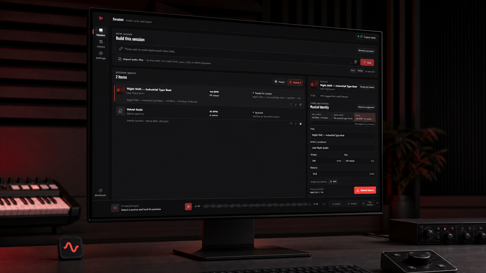
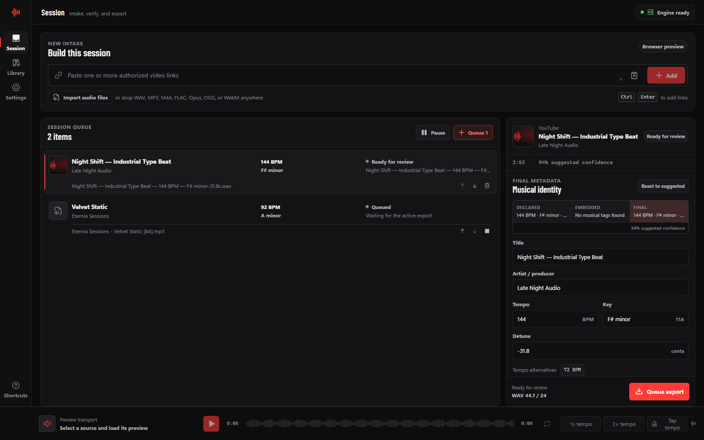
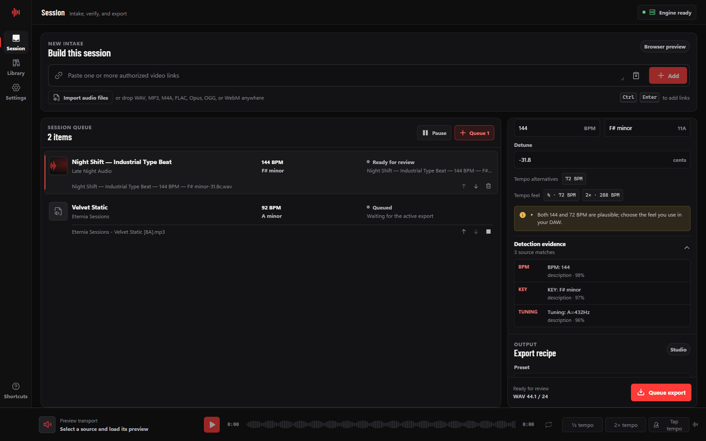
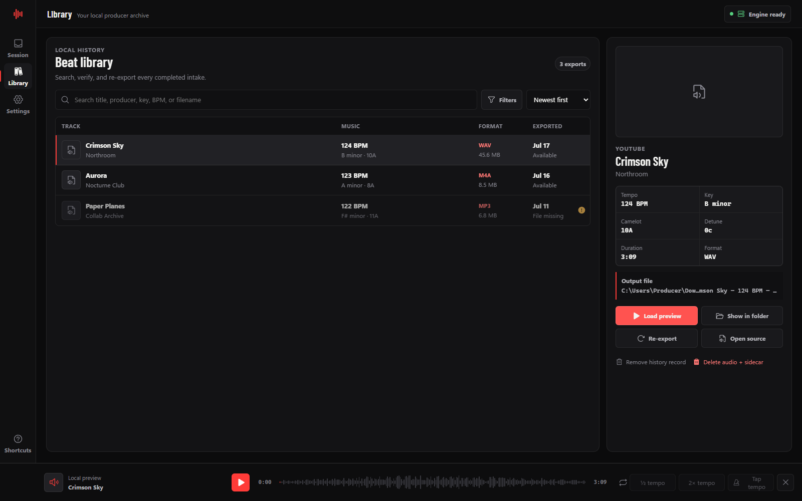
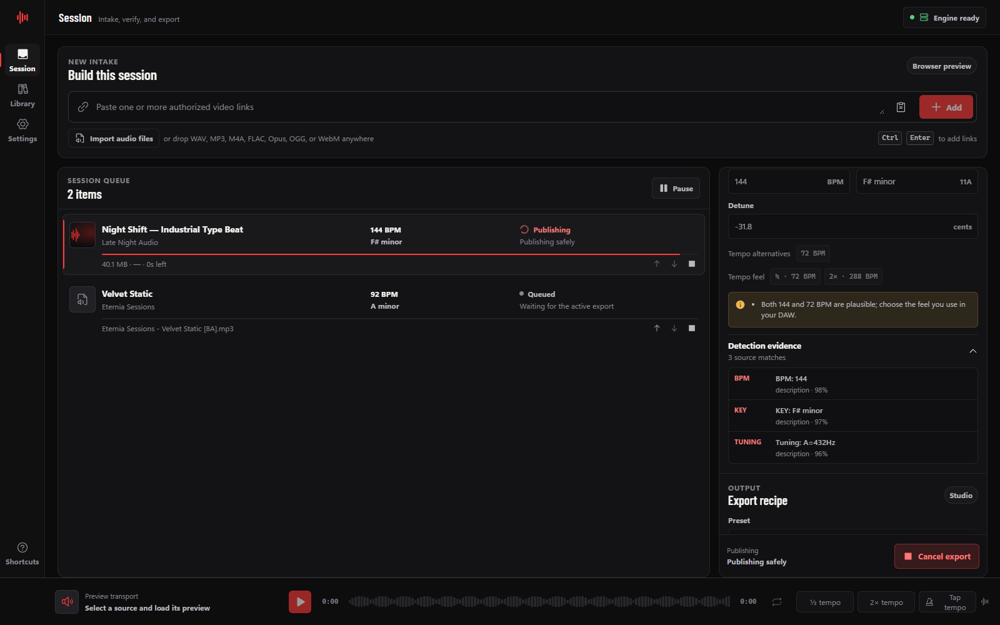

<!-- markdownlint-disable MD013 MD028 MD033 MD041 -->

<div align="center">
  
  <h1>Sonic</h1>
  <p><strong>Turn authorized beat references into organized, producer-ready files.</strong></p>
  <p>
    A local-first Windows workstation for media intake, musical metadata review,
    batch export, and beat library organization.
  </p>
  <p>
    <a href="https://github.com/eterniastudio/sonic/actions/workflows/ci.yml"></a>
    <a href="https://github.com/eterniastudio/sonic/releases/latest"></a>
    
    <a href="LICENSE"></a>
  </p>
  <p>
    <a href="https://github.com/eterniastudio/sonic/releases/latest"><strong>Download for Windows</strong></a>
    ·
    <a href="#see-sonic">See the interface</a>
    ·
    <a href="#build-from-source">Build from source</a>
  </p>
</div>



<div align="center">
  <sub>Designed and published by <a href="https://github.com/eterniastudio">Eternia Studios</a>, an individual creator account.</sub>
</div>

> [!IMPORTANT]
> Sonic is for media you own or are authorized to download and process. It
> does not bypass DRM, authentication, private-video access, geographic
> restrictions, or platform safeguards. Sonic is not affiliated with or
> endorsed by YouTube.

## Producer intake, without the converter-site experience

Sonic replaces the fragile “download, rename, inspect, convert, and somehow
remember where it went” routine with one focused desktop workspace.

| Intake | Verify | Export | Organize |
| --- | --- | --- | --- |
| Add authorized YouTube links or drop local audio. | Compare source text, embedded tags, parsed suggestions, and your final values. | Choose a fixed producer-ready recipe and safe filename. | Search, audition, reveal, and re-export from the local Beat Library. |

No Sonic account. No subscription. No analytics. No hosted conversion
backend. Your queue, metadata decisions, exports, and library stay on your
Windows machine.

## See Sonic

### One session, every decision in view



Review source identity, BPM, key, Camelot value, detune, text/tag match
strength, filename, destination, and export recipe without leaving the
session.

### Trace every suggestion to its source



See the exact title or description matches behind BPM, key, and tuning
suggestions before committing them to an export.

### A real local archive



Search completed exports, detect missing files, and audition audio from the
persistent waveform transport.

### Safe publication you can watch



Every job moves through acquisition or local copy, conversion, tagging,
validation, and no-clobber publication. Pause dispatch, cancel active work,
reorder pending items, or retry interrupted exports.

<sub>The product gallery uses Sonic's deterministic browser-preview fixture and synthetic producer data, so documentation captures never need real media, URLs, or personal paths. Native-only actions are labelled in the interface.</sub>

## The workflow

1. **Build a session.** Paste one or more authorized video links, pick local
   audio, or drag supported files into Sonic.
2. **Review the evidence.** Sonic reads source text and supported tags, then
   presents the parsed matches, conflicts, match strength, and editable final
   values.
3. **Choose the output.** Select a fixed preset, channel policy, optional LUFS
   target, embedded-tag policy, naming template, and destination.
4. **Queue the work.** Export one reviewed item or a complete batch with one to
   three local workers.
5. **Return to the library.** Search, preview, reveal, re-export, remove the
   history record, or explicitly delete verified audio and its sidecar.

## What Sonic parses

Sonic parses producer-declared musical information from source text,
filenames, and supported embedded tags.

| Source example | Interpreted result |
| --- | --- |
| `BPM: 144`, `144 BPM` | 144 BPM |
| `72 / 144 BPM` | 144 BPM with a 72 BPM alternate |
| `KEY: F# minor`, `F#m`, `11A` | F-sharp minor / Camelot 11A |
| `detuned -18 cents`, `-0.25 st` | Signed cents offset |
| `Tuning: A=432Hz` | Approximately -31.8 cents from A440 |

The inspector deliberately keeps four concepts separate:

- **Declared** — what the source text says;
- **Embedded** — what supported container tags say;
- **Suggested** — Sonic's rule-based merge of parsed declarations and
  embedded tags; and
- **Final** — the producer's editable decision used for naming and export.

Sonic supports common major, minor, modal, sharp/flat, compact, and Camelot
key formats; alternate and half/double-time tempos; detune in cents,
semitones, half-steps, or directional language; source evidence; text/tag
match strength; and conflict warnings.

> [!CAUTION]
> Sonic v0.2 does **not** derive BPM, key, or tuning from the audio signal. It
> parses declared text and embedded metadata, then asks the producer to verify
> or correct the final values. Audio-derived analysis is a future boundary,
> not a current marketing claim.

## Built for producer workflows

### Sessions and queue

- Independent metadata and export settings for every source.
- Persistent SQLite job state, ordering, pause state, and event history.
- One, two, or three concurrent workers.
- Progress, speed, ETA, stage, cancellation, retry, and revision-safe edits.
- Startup recovery for interrupted jobs and already-published pairs.
- Batch review without hidden playlist ingestion.

### Local audio intake

Sonic accepts WAV, MP3, M4A, FLAC, Opus, OGG, and WebM audio. The native core
requires an absolute, regular, non-reparse file; checks its type and configured
size limit; verifies that ffprobe reports an audio stream; computes a SHA-256
source fingerprint; and rechecks that fingerprint before export.

### Producer-ready export recipes

Sonic exposes fixed recipes rather than arbitrary FFmpeg arguments.

| Preset | Output behavior |
| --- | --- |
| Original stream | Preserve the acquired or local stream when possible. |
| MP3 V0 | High-quality variable-bitrate MP3. |
| MP3 320 | Constant 320 kbps MP3. |
| M4A AAC 256 | AAC at 256 kbps in an M4A container. |
| WAV 44.1 / 24 | 24-bit PCM for common music sessions. |
| WAV 48 / 24 | 24-bit PCM for 48 kHz production and video sessions. |
| FLAC | Lossless compressed audio. |
| Opus 192 | Efficient 192 kbps Opus audio. |

Processed presets can preserve channels, force stereo or mono, write
supported embedded tags, and optionally normalize between -24 and -8 LUFS.
Conversion cannot restore quality that is absent from the source.

### Naming and sidecars

Templates support producer-oriented tokens:

```text
{title} {producer} {bpm} {key} {camelot} {detune} {preset} {source} {date}
```

```text
{producer} - {title} [{bpm} BPM] [{key}]
{title}_{camelot}_{detune}_{preset}
```

Rust is authoritative for rendering and sanitizing filenames. Unknown tokens,
control characters, unsafe Windows device names, and path-like filenames are
rejected. Collisions receive numbered suffixes; existing files are never
silently replaced.

Every processed export receives a versioned `.sonic.json` sidecar with source
identity and fingerprint, final metadata, evidence and warnings, output audio
properties, export recipe, tag readback status, output SHA-256, and Sonic
schema/version identifiers. Full local source paths are excluded by default.
See the [sidecar v1 reference](docs/sidecar-schema.md).

### Beat Library and preview transport

- Search title, producer, filename, BPM, key, or Camelot value.
- Filter by format, tempo range, key, or missing-file state.
- Load a bounded local preview with waveform seek and loop.
- Tap tempo or apply half-time/double-time correction.
- Reveal the export, open an available source, or create a new export.
- Remove history without deleting audio, or explicitly delete a verified
  audio/sidecar pair.

Deletion is conservative: Sonic revalidates file identity, sidecar identity,
and audio hash before it removes anything. Changed or replaced files are left
untouched.

## Local-first by design

The React renderer cannot execute arbitrary processes or access arbitrary
files. The Rust/Tauri core owns URL and path validation, SQLite writes,
filename rendering, process arguments, cancellation, staging, publication,
preview scoping, deletion, and diagnostics.

- Canonical HTTPS video URLs only; no playlist, live, private-auth, or cookie
  modes. The acquisition engine also disables yt-dlp plugins, remote
  components, and media-tool self-updates. Sonic's signed application updater
  is a separate, narrowly configured path.
- Absolute verified executable paths and a minimal subprocess environment.
- No shell interpolation and no arbitrary FFmpeg option input.
- Duration, source-size, free-space, concurrency, preview, and queue limits.
- Same-volume private staging and no-replace paired publication.
- Redacted diagnostic exports without source URLs or personal paths.
- No product analytics and no hosted Sonic conversion backend.

Sonic is **local-first, not offline**. Network access occurs when you inspect
or acquire an authorized remote URL, explicitly install the pinned media
engine, or check GitHub for a Sonic update.

## Download and updates

### Public Windows installer

[**Download the latest Windows x64 installer →**](https://github.com/eterniastudio/sonic/releases/latest)

Sonic v0.2.0 targets Windows 10/11 x64 and Microsoft WebView2. The latest
verified installer and its release artifacts are available from the link
above.

> [!WARNING]
> The installer is not currently Authenticode-signed, so Windows SmartScreen
> may warn before installation. The v0.2 release includes `SHA256SUMS.txt` and
> GitHub build-provenance attestation for independent verification.

<details>
<summary><strong>Verify the installer checksum</strong></summary>

Download the installer and `SHA256SUMS.txt` from the same release, open
PowerShell in that folder, and run:

```powershell
$installer = Get-ChildItem .\Sonic_*-setup.exe | Select-Object -First 1
$expected = (Select-String .\SHA256SUMS.txt -Pattern 'Sonic_.*-setup\.exe').Line.Split()[0]
$actual = (Get-FileHash -Algorithm SHA256 -LiteralPath $installer.FullName).Hash
if ($actual.ToLowerInvariant() -ne $expected.ToLowerInvariant()) {
  throw "Installer checksum mismatch"
}
```

</details>

### Beginning with v0.2: signed in-app updates

Installed v0.2+ builds check the latest Eternia Studios GitHub Release shortly
after startup. Sonic reports availability first; download and installation
require an explicit click in **Settings → Software update**. Tauri verifies the
updater artifact against the public key embedded in Sonic before Windows runs
the passive installer.

People on v0.1.x need one final manual installer upgrade before in-app updates
become available.

### First-run media engine setup

The installer contains pinned yt-dlp and CPython components. FFmpeg, ffprobe,
and Deno are installed only after an explicit **Set up engine** action. Sonic
downloads immutable pinned artifacts from upstream release hosts, verifies
archive and executable hashes, records provenance, and re-verifies the tools
before launch.

- Approximate download: 180 MiB.
- Local path: `%LOCALAPPDATA%\studio.eternia.sonic\media-engine`.
- No global Node.js, Python, yt-dlp, Deno, or FFmpeg installation required.
- Exact versions, origins, hashes, and licenses live in
  [`scripts/tool-manifest.json`](scripts/tool-manifest.json).

<details>
<summary><strong>Release contents and integrity</strong></summary>

Beginning with v0.2, a tagged release is designed to include:

- the NSIS installer, updater signature, and `latest.json`;
- `SHA256SUMS.txt` and GitHub build-provenance attestation;
- npm and Cargo CycloneDX SBOMs;
- generated dependency-license reports;
- the pinned media-tool manifest and FFmpeg build configuration; and
- Sonic's license, third-party notices, and applicable license texts.

Release CI validates versions, tests both codebases, fetches pinned tools,
builds the installer, silently installs and launches it on a clean Windows
runner, verifies packaged tools and icons, validates update metadata,
uninstalls it, checks cleanup, hashes the result, and attests the artifacts.

</details>

## Architecture

| Layer | Responsibility |
| --- | --- |
| React 19 + TypeScript | Session state, review UI, Library, Settings, transport, typed native bridge, and deterministic browser fixture. |
| Rust + Tauri 2 | Validated commands, acquisition, scheduling, presets, filesystem policy, SQLite, previews, sidecars, tool isolation, and recovery. |
| Pinned media engine | CPython + yt-dlp for authorized acquisition, Deno for supported challenge execution, and FFmpeg/ffprobe for verified media work. |

The acquisition provider sits behind the native boundary, so local-file,
metadata, export, and library workflows remain useful independently of one
remote provider.

## Build from source

### Requirements

- Windows 10/11 x64;
- Node.js 22 and npm;
- Rust 1.94.0 with the MSVC target, rustfmt, and Clippy;
- Tauri's Windows prerequisites and Microsoft WebView2; and
- PowerShell 5.1 or later.

### Run Sonic

```powershell
npm ci
npm run tools:fetch
npm run tauri dev
```

For browser-only interface work, use the deterministic preview adapter:

```powershell
npm run dev
```

It exercises the product interface without native file or process access.

<details>
<summary><strong>Run the principal quality gates</strong></summary>

```powershell
./scripts/validate-release-version.ps1
npm audit --audit-level=high
npm run installer:smoke:verify
npm run updater:manifest:verify
npm run test:coverage
npm run check
npm run build
npm run bundle:budget
cargo fmt --manifest-path src-tauri/Cargo.toml --check
cargo clippy --manifest-path src-tauri/Cargo.toml --all-targets --all-features -- -D warnings
cargo test --manifest-path src-tauri/Cargo.toml --all-features
cargo audit --file src-tauri/Cargo.lock
```

The live media-engine check is intentionally manual because it contacts
YouTube. After fetching tools, `npm run media:e2e` uses Sonic's production
arguments against the default NASA SVS public-domain source, creates a bounded
eight-second MP3, verifies tags through ffprobe, and removes its temporary
workspace.

</details>

## Documentation

| Document | Purpose |
| --- | --- |
| [Changelog](CHANGELOG.md) | Version history and unreleased work. |
| [Security](SECURITY.md) | Trust boundary, release verification, and vulnerability reporting. |
| [Contributing](CONTRIBUTING.md) | Development workflow and review expectations. |
| [Verification guide](tests/VERIFICATION.md) | Manual and automated release checks. |
| [Sidecar schema](docs/sidecar-schema.md) | `.sonic.json` v1 fields, privacy behavior, and integrity rules. |
| [Metadata claims boundary](docs/metadata-claims-boundary.md) | Current parser behavior and rules for any future audio-derived estimates. |
| [Third-party notices](THIRD_PARTY_NOTICES.md) | Dependency and bundled-tool attribution. |

<details>
<summary><strong>Repository layout</strong></summary>

```text
src/                    React app, domain models, features, fixture, services
src-tauri/src/          Modular Rust native core
src-tauri/capabilities/ Minimal main-window permissions
src-tauri/icons/        App, executable, and installer artwork
src-tauri/windows/      NSIS lifecycle hooks
tests/                  Frontend, contract, interaction, and accessibility tests
scripts/                Tool pinning, release, SBOM, installer, and QA scripts
docs/                   Product media, schema, and compliance references
.github/workflows/      CI and release-installer automation
```

</details>

## Roadmap boundaries

The next producer-intelligence phase may add audio-derived tempo, key, and
tuning estimates with explicit confidence and Declared-versus-Detected
comparison. Detected values must never silently replace the producer's final
metadata. The contract for that future work is documented in the
[metadata claims boundary](docs/metadata-claims-boundary.md); it is not a v0.2
feature claim.

Cookie import, DRM bypass, credential capture, playlist scraping, arbitrary
download providers, arbitrary FFmpeg arguments, and silent media-tool
self-updates are deliberately outside Sonic's scope.

## License

Sonic's original source and assets are source-available under the proprietary
terms in [LICENSE](LICENSE). Third-party components retain their own licenses
as documented in [THIRD_PARTY_NOTICES.md](THIRD_PARTY_NOTICES.md) and the
generated release reports.

<div align="center">
  <sub>Built for producers by <a href="https://github.com/eterniastudio">Eternia Studios</a>.</sub>
</div>
