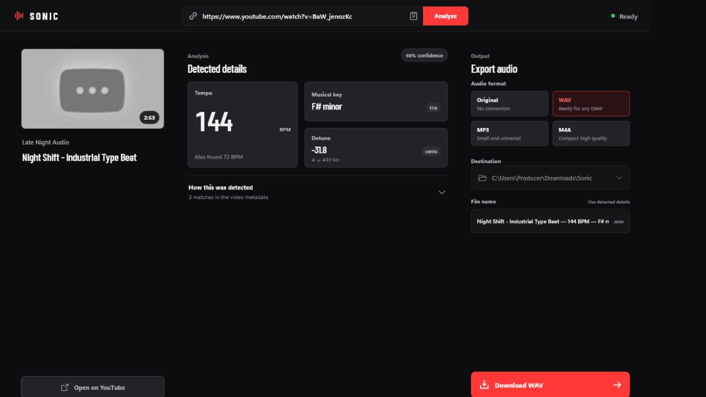

# Sonic

Sonic is a local-first YouTube beat downloader for producers. Paste a video URL, let Sonic read the BPM, key, tuning, and detune markers from the description, then save the audio in a format that is ready for a DAW.

## Why Sonic exists

Producer workflows should not depend on ad-filled converter sites. Sonic runs the downloader and media conversion tools locally, with the only network request being the source lookup against YouTube and its supporting endpoints.

There are no accounts, subscriptions, browser extensions, analytics, or hosted conversion services in the app.

## Features

- Inspect a YouTube video before downloading.
- Extract labelled BPM values, including half-time alternatives such as 72 / 144 BPM.
- Parse major, minor, modes, sharp/flat spellings, compact producer descriptions, and Camelot keys.
- Detect detune written in cents, semitones, half-steps, or directional language.
- Convert tuning references such as A=432Hz into a cents offset.
- Show the exact description text that produced each detected value.
- Edit BPM, key, and detune before exporting.
- Download original audio or convert to WAV, MP3, or M4A.
- Stream progress, speed, ETA, conversion status, cancellation, and final file location.
- Generate producer-friendly filenames from the detected musical data.
- Keep all conversion and metadata work on the local machine.

## Download

Download the latest Windows installer from [Eternia Studios releases](https://github.com/EterniaStudios/sonic/releases/latest).

The release page includes:

- Sonic version x64 setup.exe — the Windows NSIS installer.
- SHA256SUMS.txt — the checksum for verifying the installer.

The installer bundles yt-dlp, FFmpeg, ffprobe, and Deno. End users do not need Node.js, Rust, Python, FFmpeg, or yt-dlp installed globally.

Sonic is currently Windows-first and targets Windows 10/11 x64. The app uses WebView2, which is included on current Windows installations and can be installed through Microsoft's WebView2 bootstrapper when needed.

## Quick start

1. Download the latest Sonic x64 setup installer from the releases page.
2. Run the installer. Windows may show a SmartScreen warning because private builds are not code-signed.
3. Open Sonic.
4. Paste a YouTube video URL into the top bar and choose Analyze.
5. Review or edit Tempo, Musical key, and Detune.
6. Choose the output format and destination, then select Download.

Use Sonic with media you are authorized to save. The app does not bypass private-video access, geographic restrictions, or account authentication.

## Metadata extraction

Sonic checks the video title and description for producer-friendly markers.

### BPM

Recognized forms include:

~~~text
BPM: 144
144 BPM
Tempo 144
72 / 144 BPM
~~~

Timestamps, years, bitrates, and unrelated numbers are rejected. When two labelled values form a half-time pair, Sonic keeps the alternate BPM visible instead of silently discarding it.

### Key

Recognized forms include:

~~~text
KEY: F# minor
Key - F♯m
Ab major
C Dorian
11A
~~~

The parser normalizes common Unicode sharp and flat characters and maps supported keys to Camelot notation where possible.

### Detune and tuning

Recognized forms include:

~~~text
Detuned -32 cents
-31.8¢
Down 1 semitone
Tuning: A=432Hz
~~~

Explicit cents are preferred. If a tuning frequency is present, Sonic calculates the equivalent cents offset relative to A440 and displays the source evidence.

Conflicting labelled values are surfaced as warnings so the producer can make the final call.

## Output formats

| Format | Use it when |
| --- | --- |
| Original | You want the best available source stream without a conversion step. |
| WAV | You want a straightforward file for a DAW session or sample workflow. |
| MP3 | You need a compact, widely compatible file. |
| M4A | You want efficient AAC audio with good quality per megabyte. |

Converting a source file to WAV does not increase its source quality; it only creates a convenient DAW-compatible container.

## Privacy and security

Sonic is designed to avoid the risks of public downloader websites.

- yt-dlp, FFmpeg, ffprobe, and Deno run as bundled local sidecars.
- The app disables user yt-dlp configuration files, plugins, remote components, self-updates, playlist expansion, and shell expansion.
- Download paths and filenames are validated before they reach the local tools.
- The app uses a dedicated Downloads/Sonic folder by default.
- Active downloads can be cancelled and Windows process trees are cleaned up.
- Release sidecars are fetched from their official upstream artifacts and checksum-verified by scripts/fetch-tools.ps1.
- GitHub release installers include a SHA-256 checksum file.

Sonic still connects to YouTube when you inspect or download a URL. It is local-first, not offline.

## Architecture

~~~text
React + TypeScript UI
          |
          v
Tauri 2 commands and events
          |
          +--> yt-dlp (metadata + source audio)
          +--> Deno (yt-dlp JavaScript challenge runtime)
          +--> FFmpeg / ffprobe (format conversion + progress)
~~~

The desktop shell is Tauri 2. The frontend is React and Vite. The backend is Rust and owns URL validation, sidecar execution, cancellation, progress parsing, safe paths, and metadata extraction.

## Repository layout

~~~text
src/
  App.tsx              React workflow and native command wiring
  App.css              Sonic visual system and responsive layout
src-tauri/
  src/lib.rs           Tauri commands, download jobs, progress events
  src/metadata.rs      BPM, key, detune, and tuning parser
  binaries/             Locally fetched release sidecars (ignored)
  icons/                App, installer, and platform icon assets
scripts/
  fetch-tools.ps1      Fetches and verifies local media tools
.github/workflows/
  ci.yml               TypeScript, Rust, and frontend validation
  release.yml          Windows installer and GitHub release automation
~~~

## Development setup

### Requirements

- Windows 10/11 x64
- Node.js 22+
- Rust stable with the x86_64-pc-windows-msvc target
- Microsoft C++ Build Tools
- WebView2

### Install and fetch sidecars

~~~powershell
npm install
npm run tools:fetch
~~~

The fetch script downloads the pinned yt-dlp, FFmpeg/ffprobe, and Deno artifacts, verifies their published SHA-256 checksums, and places them under src-tauri/binaries.

### Run the desktop app

~~~powershell
npm run tauri dev
~~~

The Vite-only preview is useful for UI work:

~~~powershell
npm run dev
~~~

The browser preview uses a deterministic demo video and simulated progress. Real downloads require the Tauri desktop build.

### Validation

~~~powershell
npm run check
npm run build
cargo fmt --manifest-path src-tauri/Cargo.toml --check
cargo test --manifest-path src-tauri/Cargo.toml
cargo check --manifest-path src-tauri/Cargo.toml
~~~

### Build a local installer

~~~powershell
npm run tools:fetch
npm run tauri build
~~~

The installer is written to:

~~~text
src-tauri/target/release/bundle/nsis/Sonic_<version>_x64-setup.exe
~~~

## Release automation

GitHub Actions builds the Windows installer for users so they never need to assemble the project locally.

### Pull requests and branch pushes

.github/workflows/ci.yml runs on pull requests and pushes to main or master. It validates:

- TypeScript checks
- Vite production build
- Rust formatting
- Rust unit tests

### Versioned releases

.github/workflows/release.yml runs for tags matching v*.

It:

1. Creates a clean Windows runner.
2. Installs Node.js and Rust.
3. Fetches and verifies the pinned media sidecars.
4. Builds the Tauri NSIS installer.
5. Generates SHA256SUMS.txt.
6. Uploads the installer artifact.
7. Creates a GitHub Release with the installer and checksum attached.

To publish a new release:

~~~powershell
git checkout main
git pull

# Update package.json, package-lock.json, src-tauri/Cargo.toml,
# src-tauri/Cargo.lock, and src-tauri/tauri.conf.json to the same version.
git add package.json package-lock.json src-tauri/Cargo.toml src-tauri/Cargo.lock src-tauri/tauri.conf.json
git commit -m "release: v0.1.2"
git tag v0.1.2
git push origin main --follow-tags
~~~

The tag push is the release trigger. The repository's GitHub Actions permissions must allow contents: write for the release workflow.

## Troubleshooting

### The installer does not start

Install or repair Microsoft WebView2, then retry the installer. If Windows blocks the unsigned private build, select More info and Run anyway.

### Sonic says the local engine is not ready

This usually means a sidecar is missing or blocked by antivirus software. For a development checkout, run:

~~~powershell
npm run tools:fetch
~~~

Then restart Sonic. The app's startup status shows which of yt-dlp, FFmpeg, ffprobe, and Deno are available.

### No BPM or key was found

Not every video description has structured musical metadata. Sonic leaves the fields editable so you can enter values manually. Open How this was detected to inspect the exact matches it did find.

### A live video cannot be downloaded

Sonic intentionally rejects live sources. Wait until the stream has ended and inspect the finished video again.

## Project status

Sonic is a focused private-use release from Eternia Studios. The current release supports one YouTube video at a time and audio export on Windows. Playlist downloads, authenticated browser cookies, and video export are intentionally out of scope for this build.
